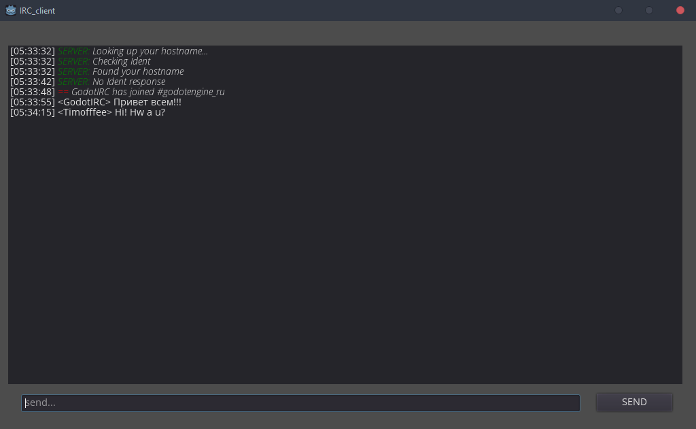

# GodotIRC
A modified version of IRC client on Godot engine from timofffee 

Patreon: https://www.patreon.com/timofffee

ver. 0.1

### Features:
* Works on Godot 3.x with inspiRCD (new !)
* Checks for a lot of Errors (new !)
* Receive Whispers  (new !)
* Display user list (new !)
* Able to recover from being disconnected (new !)
* Connect to irc servers
* Enter password
* Display the JOIN, QUIT, PART, NOTICE, PRIVMSG
* Auto answer on PING
* Ready for code enhancements and changes
* Russian language support [broken]
* Add support for BB-code (Color, bold/italic text) [broken]

### Plans:
* Being able to mute users (new !)
* Enter commands, using a slash (/JOIN, /MSG, etc.)
* Add more commands to display
* Sounds for comfortable tracking of events
* Support for multiple channels simultaneously
* Plugin for Godot engine (GodotIRC Plugin)

## Credits

- Goutte for the idea
- timofffee for the protocol's practices
- Adrenesis for the port on Godot 3.x

# Original README
## GodotIRC
IRC client on Godot engine

ver. 0.0.17

Patreon: https://www.patreon.com/timofffee

Features:
* Connect to irc servers
* Enter password
* Display the JOIN, QUIT, PART, NOTICE, PRIVMSG
* Auto answer on PING
* Ready for code enhancements and changes
* Russian language support
* Add support for BB-code (Color, bold/italic text)

Plans:
* Enter commands, using a slash (/JOIN, /MSG, etc.)
* Add more commands to display
* Sounds for comfortable tracking of events
* Support for multiple channels simultaneously
* Plugin for Godot engine (GodotIRC Plugin)
